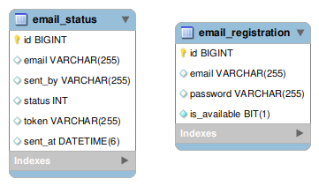

# OnCot Email Service Functionality

This application would send the online drive invitations emails to the registered candidates.

## Project Details
* JDK 1.8 and above
* Spring boot version 2.4.5 and above
* Eclipse or any equivalent IDE
* Maven build tool

## Deployment Details
1. export enviorment varibles from .env file into the enviorment - command -> export $(cat .env | xargs)
2. (Optional) Install maven if not present - command -> sudo apt install maven
3. Build production jar - command -> mvn install 
4. Install JDK 1.8 on the aws ec2 instance
5. After creating a aws rds database note the endpoints ,username and password of the same.
6. Create .env file which will contain the enviorment variables. Copy the contents of .env file which is present in above folder structure into the newly created .env file. Update the database enpoint username and password in .env file as per the rds database.
7. Export .env file contets into the enviorment - command -> export $(cat .env | xargs) 
8. Run project - command -> java -jar "name of jar file"
9. (Optional) To deploy actuator ui repeat steps 1,2(if deployment is on new ec2 instance),6.

## Steps to run the project on local machine
1. Clone the project 
2. Open eclipse IDE and follw the path : File -> import -> maven -> existing maven projects -> select cloned project -> click next until finish 
3. Update the project 
4. Run as "spring boot App"
5. This project will run on in-built tomcat server on default port: 8080

## WorkFlow
1. User needs to register the sender email-id/s.
2. User  need provide the email-id and token of candidate so that email can be sent to the candidate.
3. (optional) After sending all the emails user can delete the sender email-id's
4. User can also check the status of the sent email/s.

## Endpoint Details
By default, endpoints are exposed over http via application port. 
Base path: http://localhost:8080

 * Register sender email-id/s :  
  `POST /api/v1/register ` 
  Use this api to register  sender email-id/s.  For more details please [refer](http://oncot-emailfunctionality-v1.herokuapp.com/swagger-ui/) swagger api document.

  * Get registered email-id's  
  `GET /api/v1/emails` 
  Use this api to get the list of registered email-id/s.  For more details please [refer](http://oncot-emailfunctionality-v1.herokuapp.com/swagger-ui/) swagger api document.
 
 * Delete registered email-id/s  
  `DELETE /api/v1/email/{id}`  
 Use to delete the registered email-id/s.For this  user needs to provide the id of the registered sender email that needs to be delete. For more details please [refer](http://oncot-emailfunctionality-v1.herokuapp.com/swagger-ui/) swagger api document.
 

 * Send email  
  `POST api/v1/sendEmails (Currently functional)` 
 Use this api to send emails to multiple candidates in a single request. User needs to provide array of emails and tokens of candidates.  For more details please [refer](http://oncot-emailfunctionality-v1.herokuapp.com/swagger-ui/) swagger api document.

 * Status of sent emails  
  `GET /api/v1/emailStatus` 
 Use this api to check the status of sent emails.  For more details please [refer](http://oncot-emailfunctionality-v1.herokuapp.com/swagger-ui/) swagger api document.

 ## Exceptions that can occur 
* `com.sun.mail.smtp.SMTPSendFailedException :-`  
This exception occures when daily limit of sender's email accounts gets exceeded. In this case application will react in two ways :-  
  - If Excption occured while sending of emails is in progress then remaining emails which cant be sent will be updated with FAILED status. 
  - If exception has already occured and then user sends new request to send emails then Http status 422 sent back by the filter thereby not allowing request to reach the application.

  Note:- This exception is thrown by gmail smtp server so the email-id cant be used to send emails for next 24 hours.

* `AuthenticationFailedException :-`  
This exception occurs when there are too many login attempts made by the application in a specific time interval. If this exception occures the application would pause for 15 minutes and then resume sending the remaing emails.

* `com.sun.mail.smtp.SMTPAddressFailedException :-`  
This exception occures when there is invalid email address provided by user. 

* `com.sun.mail.util.MailConnectException :-`  
This exception occurs when the connection between the app and smtp server fails/breaks.In this case the application would pause for 10 minutes and then would resume sending the pending emails after the completeio of time frame.

## Database Schema

### Database Name - email_service

